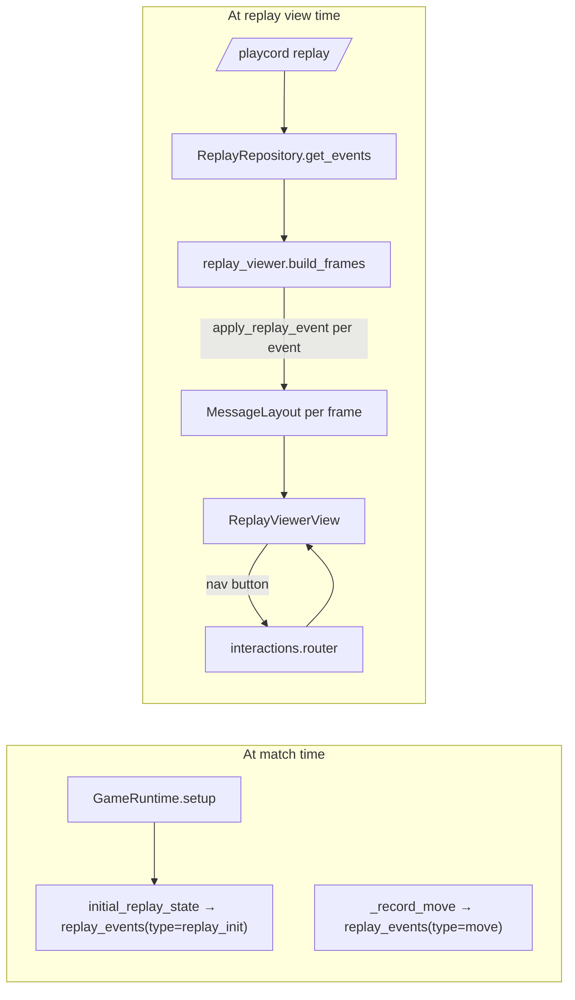

## Scope

Four deliverables from `BROKEN.md` section `0.8.0`:

1. Replay UX update (recent-games line + turn-by-turn replay viewer)
2. Standardize ELO on conservative rating (CR)
3. API updates (remove `LegacyGamePlugin`, drop duplicate class attrs, resolve metadata callbacks)
4. Version bump to `0.8.0`

Reference files cited throughout: `[playcord/games/api.py](playcord/games/api.py)`,
`[playcord/games/plugin.py](playcord/games/plugin.py)`,
`[playcord/games/tictactoe/__init__.py](playcord/games/tictactoe/__init__.py)`,
`[playcord/application/services/game_runtime.py](playcord/application/services/game_runtime.py)`,
`[playcord/application/services/match_lifecycle.py](playcord/application/services/match_lifecycle.py)`,
`[playcord/presentation/cogs/general.py](playcord/presentation/cogs/general.py)`,
`[playcord/configuration/locale/en.toml](playcord/configuration/locale/en.toml)`,
`[playcord/domain/rating.py](playcord/domain/rating.py)`,
`[playcord/infrastructure/app_constants.py](playcord/infrastructure/app_constants.py)`.

---

## 1. Replay UX

### 1a. Fix "Recent games" line

Target: change today's `Tic-Tac-Toe · 1st/1 | seat #1 | rated | completed | 0` to
`Tic-Tac-Toe (f87ab68) · Draw | rated | +0`.

- Rewrite `embeds.profile.match_format` in
  `[playcord/configuration/locale/en.toml](playcord/configuration/locale/en.toml)` around line 633 to:
  `**{game_name}** ({match_code}) · {outcome} | {rated_status} | {delta}`
- In `[playcord/presentation/cogs/general.py](playcord/presentation/cogs/general.py)` near lines 1226-1255, pass:
    - `match_code` from the history row (already returned as `match_code` by `v_user_match_history`).
    - `outcome` = per-player outcome string from `metadata.outcome_summaries[user_id]`, falling back to
      `metadata.outcome_global_summary`, falling back to a derived label from `final_ranking`/`status` (
      Win/Loss/Draw/Interrupted).
    - Drop `ranking/player_count`, `seat`, and `status` from the format.
- Remove `_match_summary_for_user` suffix concatenation (the outcome is now the primary column); keep the helper only
  for the `/playcord history` detail view around line 1392.
- Delete now-unused locale keys: `embeds.profile.match_summary_suffix`, `history.seat`, and corresponding usages.

### 1b. Outcome strings from plugins

The plumbing already exists:

- `[playcord/application/services/match_lifecycle.py](playcord/application/services/match_lifecycle.py)` lines 88-123
  collects `match_global_summary(outcome)` and `match_summary(outcome)` from the plugin and persists them into
  `matches.metadata` as `outcome_global_summary` / `outcome_summaries`.
- However `match_global_summary` / `match_summary` live on the legacy `Game` base class (
  `[playcord/domain/game.py](playcord/domain/game.py)` lines 184-188) and are NOT part of the new `GamePlugin` in
  `[playcord/games/api.py](playcord/games/api.py)`.

Changes:

- Add two optional methods to `GamePlugin` (default `return None` / `{}`):
    - `match_global_summary(self, outcome: Outcome) -> str | None`
    - `match_summary(self, outcome: Outcome) -> dict[int, str] | None`
- Implement both for `TicTacToePlugin` in
  `[playcord/games/tictactoe/__init__.py](playcord/games/tictactoe/__init__.py)` (e.g. "X won by taking the top row" /
  per-player "You won" or "You lost").
- `match_lifecycle.finish_match` already uses `getattr(..., callable)`; no change needed, but the `Game`-class copies
  can be deleted once the legacy `Game` goes away in item 3.

### 1c. Turn-by-turn replay viewer

Chosen approach (from user): plugins expose `apply_replay_event` + `render_replay`; replay state is reconstructed by
replaying from an initial state.

- New types in `[playcord/games/api.py](playcord/games/api.py)`:
    - `@dataclass(frozen=True) class ReplayState` — holds `game_key`, `players: list[Player]`, `match_options: dict`,
      `move_index: int`, and opaque `state: Any` (plugin-owned snapshot).
    - Extend `GamePlugin` with:
        - `initial_replay_state(self, ctx: GameContext) -> ReplayState` — called once at match start (runtime logs
          payload into `replay_events` as a special `"replay_init"` event).
        - `apply_replay_event(self, state: ReplayState, event: dict) -> ReplayState` — pure, side-effect-free state
          transition.
        - `render_replay(self, state: ReplayState) -> MessageLayout` — returns the same `MessageLayout` type used by
          `render()`.
    - Default implementations return `None`; if any is missing the viewer falls back to the current event list.
- Wire `initial_replay_state` in `GameRuntime.setup()` in
  `[playcord/application/services/game_runtime.py](playcord/application/services/game_runtime.py)` near lines 95-114 to
  persist a `{"type": "replay_init", "state": <json>}` event.
- `TicTacToePlugin` implementation:
    - State = `{"board": list[list[str]], "turn": int}`.
    - `apply_replay_event` handles the existing `"move"` event shape already produced by `GameRuntime._record_move`.
    - `render_replay` returns the existing board grid layout but with buttons disabled.

#### Viewer UI

- New service `[playcord/application/services/replay_viewer.py](playcord/application/services/replay_viewer.py)`:
    - `build_frames(plugin_class, events, players, match_options) -> list[MessageLayout]` — replay sequentially with
      `apply_replay_event`, producing a `MessageLayout` for each move index (including move 0).
- New view `[playcord/presentation/ui/views/replay_viewer.py](playcord/presentation/ui/views/replay_viewer.py)` that
  renders a frame inside a `Container` and adds an `ActionRow` with:
    - `⏮ First`, `◀ Prev`, `Move N/M` (disabled text button), `Next ▶`, `Last ⏭`, `Seek…` (opens a `Select` with up to
      25 move bookmarks).
    - Buttons route through `CustomId` with namespace `replay`, action `nav`, payload `match_id=<id>&frame=<n>`; routed
      in `[playcord/presentation/interactions/router.py](playcord/presentation/interactions/router.py)`.
- Modify `command_replay` in `[playcord/presentation/cogs/general.py](playcord/presentation/cogs/general.py)` (lines
  1566-1625):
    - If the game's plugin implements the replay API (detected via `hasattr(plugin.metadata, "apply_replay_event")` +
      subclass check), render the interactive viewer view; otherwise keep the existing paginated event-text fallback.
    - Pre-compute all frames at request time for short games (`len(events) <= 200`); for longer games lazily re-apply on
      navigation with an LRU cache keyed on `(match_id, frame)`.
- Components-v2 safety: reuse `GameRuntime._safe_edit_message` logic — on `edit`, drop `content` when the message has
  IS_COMPONENTS_V2 (pattern already in
  `[playcord/application/services/game_runtime.py](playcord/application/services/game_runtime.py)` lines 405-445).

#### Mermaid: replay viewer data flow

---

## 2. Standardize ELO on CR

Goal: everything displayed is CR = `mu - 3*sigma`; new players' displayed rating stays 1000 (same as today).

### 2a. New starting constants

- In `[playcord/domain/rating.py](playcord/domain/rating.py)` replace the current constants:
    - `STARTING_RATING = 1000.0` (the displayed CR).
    - `DEFAULT_SIGMA_RATIO = 1 / 6` (unchanged, sigma is still 1/6 of the base scale).
    - Compute `DEFAULT_SIGMA = STARTING_RATING * DEFAULT_SIGMA_RATIO` and
      `DEFAULT_MU = STARTING_RATING + 3 * DEFAULT_SIGMA` so `conservative() == STARTING_RATING` for new accounts.
    - Update `Rating` defaults and the `display()` helper to return `str(round(self.conservative))` instead of
      `str(round(self.mu))`.
- In `[playcord/infrastructure/app_constants.py](playcord/infrastructure/app_constants.py)` line 47, replace the bare
  `MU = 1000` with `MU = DEFAULT_MU` imported from `domain.rating` (or remove the constant and import `DEFAULT_MU`
  directly). Update `match_lifecycle._rated_results` in
  `[playcord/application/services/match_lifecycle.py](playcord/application/services/match_lifecycle.py)` line 159-166 to
  construct the `trueskill.TrueSkill` environment off the new starting `mu`, not a raw `1000`.

### 2b. Database seeding

- `[playcord/infrastructure/db/sql/schema.sql](playcord/infrastructure/db/sql/schema.sql)` + any seed/migration in
  `[playcord/infrastructure/db/migrations](playcord/infrastructure/db/migrations)` — update the default `mu`/`sigma`
  columns on `user_game_ratings` to the new starting `DEFAULT_MU` / `DEFAULT_SIGMA`. Provide a forward-only data
  migration that rescales existing rows so `(mu - 3*sigma)` is preserved (i.e.
  `mu_new = mu_old + 3*(sigma_new - sigma_old)` with sigma held constant — since sigma doesn't actually change
  ratio-wise, no scaling needed, but we still rewrite defaults).
- Leaderboard SQL in `[playcord/infrastructure/db/sql/views.sql](playcord/infrastructure/db/sql/views.sql)` (lines
  49-73, 122-191) and `[playcord/utils/database.py](playcord/utils/database.py)` (lines 906-995) already order by
  `(mu - 3*sigma)`; no change needed other than making sure `conservative_rating` is what gets returned/displayed.

### 2c. Display sites

Replace `mu` with CR in:

- `[playcord/presentation/cogs/general.py](playcord/presentation/cogs/general.py)`:
    - Leaderboard loop lines 911-935 — remove the `mu=...` field; keep only `conservative`. Update locale key
      `embeds.leaderboard.ranking_format` in
      `[playcord/configuration/locale/en.toml](playcord/configuration/locale/en.toml)` line 646 to drop `mu {mu}`.
    - Profile loop lines 1142-1213 — compute `rating = round(row["mu"] - 3*row["sigma"])` for display; rename var to
      `rating`; make sure `.sort` uses the conservative value.
    - Match history delta line 1248 — keep `mu_delta` arithmetic but rename locale placeholder to `delta` (already
      named); add a comment that mu-delta equals CR-delta because sigma is per-game stationary except after match
      updates. For correctness, compute `cr_delta = (new_mu - 3*new_sigma) - (mu_before - 3*sigma_before)` using fields
      already present on the history row (`sigma_delta` + `mu_delta`).
- `[playcord/utils/models.py](playcord/utils/models.py)` `conservative_rating` property is already correct; no change.

### 2d. Acceptance check

- Leaderboards, profile rating list, recent-games delta, and `/playcord history` all show CR (no raw `mu`).
- A fresh account seeded with `DEFAULT_MU`/`DEFAULT_SIGMA` reads `1000` everywhere.

---

## 3. API updates

### 3a. Delete `LegacyGamePlugin`

- Search confirms no Python references; only `[docs/API.md](docs/API.md)` mentions it. Remove the "Current built-in
  games still use `LegacyGamePlugin`" section in `docs/API.md` (lines 22-28, 134-136). No code delete needed — the class
  does not exist in the repo anymore.

### 3b. Remove duplicated class attributes on `GamePlugin` subclasses

- Strip the block in `[playcord/games/tictactoe/__init__.py](playcord/games/tictactoe/__init__.py)` lines 78-93 (
  `name = metadata.name`, etc.). Any consumer should read from `cls.metadata.<field>`.
- Grep for `.name`, `.summary`, `.author`, `.author_link`, `.source_link`, `.time`, `.difficulty`, `.bots`, `.moves`,
  `.customizable_options`, `.role_mode`, `.player_roles` on plugin classes — route each through `.metadata.<field>`.
  Main hits: `[playcord/utils/trueskill_params.py](playcord/utils/trueskill_params.py)`,
  `[playcord/presentation/cogs/general.py](playcord/presentation/cogs/general.py)` `_GAME_METADATA` builder, matchmaking
  views.

### 3c. Resolve metadata callback names

`Move.callback`, `MoveParameter.autocomplete`, and `BotDefinition.callback` are currently ignored. Make them
authoritative.

- Add a small helper `_resolve_callback(plugin, name, default_attr)` in
  `[playcord/application/services/game_runtime.py](playcord/application/services/game_runtime.py)` that `getattr`s a
  bound method by name and raises `ConfigurationError` if unset and no default exists.
- Replace the direct `self.plugin.apply_move(...)` calls in
  `[playcord/application/services/game_runtime.py](playcord/application/services/game_runtime.py)` (lines 247, 281, 204,
  217) with resolved callbacks driven off metadata:
    - `_apply_move` / `_apply_bot_move` look up the `Move` with matching `name` in `plugin.metadata.moves`; if
      `move.callback` is set, use `getattr(plugin, move.callback)`, else error. Each move callback has the signature
      `(actor, arguments, *, source, ctx) -> tuple[ChannelAction, ...]`.
    - `handle_autocomplete` in `[playcord/presentation/cogs/games.py](playcord/presentation/cogs/games.py)` line 729
      resolves `MoveParameter.autocomplete` to a method with signature
      `(actor, current, *, ctx) -> list[tuple[str, str]]`.
    - Bot turn in `[playcord/application/services/game_runtime.py](playcord/application/services/game_runtime.py)` line
      217 resolves `BotDefinition.callback` (looked up via `plugin.metadata.bots[player.bot_difficulty].callback`) into
      a method with signature `(player, *, ctx) -> dict | None`.
- After metadata-driven dispatch is live, **remove** the abstract methods `apply_move`, `autocomplete`, `bot_move`, and
  `peek` from `GamePlugin` in `[playcord/games/api.py](playcord/games/api.py)` lines 158-185. Keep `current_turn`,
  `outcome`, `render`, `log_replay_event` abstract. Add a `peek` metadata field (
  `GameMetadata.peek_callback: str | None`) so `handle_peek` in
  `[playcord/application/services/game_runtime.py](playcord/application/services/game_runtime.py)` line 203 uses the
  same resolution pattern.
- Update `TicTacToePlugin`:
    - Rename `apply_move` → `do_move` (or keep method name but set `Move(callback="apply_move")`). Set
      `Move(name="move", callback="apply_move", ...)`.
    - Set `MoveParameter(autocomplete="autocomplete_move")` and rename `autocomplete` method to `autocomplete_move`.
    - Bot difficulties already set `callback="bot_easy|bot_medium|bot_hard"`; add those three methods (today there is
      only a single `bot_move`).

### 3d. Version bump

- `[playcord/infrastructure/app_constants.py](playcord/infrastructure/app_constants.py)` line 13: `VERSION = "0.8.0"`.
- Update `[pyproject.toml](pyproject.toml)` version.

---

## 4. Sequencing

Recommended order to keep the tree green at each step:

1. Item 3a (doc cleanup) + 3b (class-attr removal). Purely mechanical, no behavior change.
2. Item 2 (ELO standardization). Self-contained; easy to verify manually.
3. Item 3c (metadata callbacks) then remove abstract methods.
4. Item 1a (recent-games line) — depends on plugin `match_global_summary` / `match_summary` added in 1b.
5. Item 1c (turn-by-turn viewer).
6. Version bump last.
