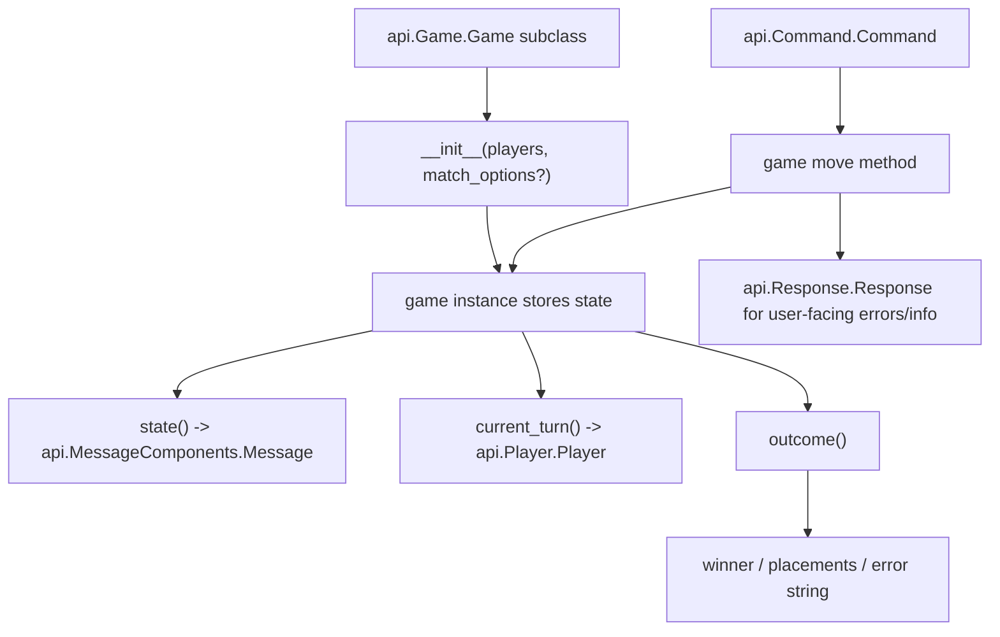

# PlayCord Game API

The `api` package is the author-facing surface for PlayCord games. If you want to add a new minigame, this is the layer
you build against: subclass `api.Game.Game`, describe your slash-style moves with `api.Command.Command` and
`api.Arguments`, render state with `api.MessageComponents`, and return `api.Response.Response` objects when a move
should show feedback instead of advancing the game.

## Getting Started

PlayCord currently targets Python 3.10+

Install the project dependencies in your local environment and work from the repository root so imports like
`from api.Game import Game` resolve the same way they do in the existing games.

```bash
python -m venv .venv
source .venv/bin/activate
pip install -U pip
pip install -e .
```

## How The API Fits Together



In practice, the bot instantiates your game with a list of `api.Player.Player` objects. If your constructor accepts a
`match_options` parameter, PlayCord passes the selected lobby options there as well.

## Module Map

- `api.Game` defines the core `api.Game.Game` base class plus `api.Game.PlayerOrder` and `api.Game.RoleMode`.
- `api.Player` defines `api.Player.Player`, the lightweight player object games receive and manipulate.
- `api.Command` defines `api.Command.Command`, which declares a move name, its options, and the callback that should
  run.
- `api.Arguments` defines option types such as `api.Arguments.String`, `api.Arguments.Integer`, and
  `api.Arguments.Dropdown`.
- `api.Bot` defines `api.Bot.Bot`, which describes an available bot difficulty for a game.
- `api.Response` defines `api.Response.Response` and `api.Response.ResponseType` for ephemeral errors, info messages,
  and styled responses.
- `api.MessageComponents` defines the layout primitives used to render game state, including
  `api.MessageComponents.Message`, `api.MessageComponents.Container`, `api.MessageComponents.TextDisplay`,
  `api.MessageComponents.Button`, and `api.MessageComponents.ThreadMessage`.
- `api.MatchOptions` defines `api.MatchOptions.MatchOptionSpec`, which describes lobby-time customization such as
  rulesets or presets.

## Quick Start: Writing A Game

The minimum shape of a PlayCord game is:

1. Create a subclass of `api.Game.Game`.
2. Fill in the class metadata used by the UI.
3. Implement `__init__`, `state`, `current_turn`, and `outcome`.
4. Define one or more `api.Command.Command` objects in `moves`.
5. Add move methods that either mutate state and return `None`, or return `api.Response.Response` when the move should
   be rejected or acknowledged without changing the main state.

Here is a compact example:

```python
from api.Arguments import Integer
from api.Command import Command
from api.Game import Game
from api.MessageComponents import Container, Message, TextDisplay
from api.Player import Player
from api.Response import Response, ResponseType


class CounterRaceGame(Game):
    summary = "Be the first player to reach the target."
    move_command_group_description = "Commands for Counter Race"
    description = "Players take turns adding to a shared counter."
    name = "Counter Race"
    player_count = 2
    moves = [
        Command(
            name="add",
            description="Add 1 or 2 to the counter.",
            options=[Integer("amount", "How much to add", min_value=1, max_value=2)],
            callback="add",
        )
    ]
    author = "@you"
    version = "1.0"
    author_link = "https://github.com/you"
    source_link = "https://github.com/PlayCord/bot"
    time = "2min"
    difficulty = "Easy"

    def __init__(self, players: list[Player]) -> None:
        self.players = players
        self.turn = 0
        self.total = 0
        self.target = 10

    def state(self) -> Message:
        return Message(
            Container(
                TextDisplay(
                    f"Total: {self.total}/{self.target}\n"
                    f"Turn: {self.current_turn().mention}"
                )
            )
        )

    def current_turn(self) -> Player:
        return self.players[self.turn]

    def add(self, player: Player, amount: int):
        if player.id != self.current_turn().id:
            return Response(
                content="It's not your turn.",
                style=ResponseType.error,
                ephemeral=True,
                delete_after=5,
            )

        self.total += amount
        self.turn = (self.turn + 1) % len(self.players)
        return None

    def outcome(self):
        if self.total >= self.target:
            previous_player = (self.turn - 1) % len(self.players)
            return self.players[previous_player]
        return None
```

### Required class metadata

Most games should define the same core attributes used by the built-in games:

- `summary`: short text shown in discovery surfaces.
- `move_command_group_description`: text used for the move command group.
- `description`: a longer explanation of how the game works.
- `name`: the human-readable game name.
- `player_count`: either a single integer or a list of supported player counts.
- `moves`: a list of `api.Command.Command` definitions.
- `author`, `version`, `author_link`, `source_link`, `time`, `difficulty`: display metadata for the game page and
  metadata surfaces.

You can also opt into richer behavior with attributes such as `bots`, `trueskill_parameters`, `player_order`,
`role_mode`, `player_roles`, `customizable_options`, `notify_on_turn`, and replay-summary hooks like
`match_global_summary`.

### Defining moves

Each entry in `moves` is an `api.Command.Command` object. A command usually includes:

- `name`: the move name exposed to the game command group.
- `description`: the user-facing help text.
- `options`: a list of `api.Arguments.Argument` subclasses.
- `callback`: the method name to invoke on the game instance. If you omit it, PlayCord falls back to the command name.

Argument objects describe how command options should be parsed:

- `api.Arguments.String` for free text or autocomplete-backed text.
- `api.Arguments.Integer` for bounded numeric input.
- `api.Arguments.Dropdown` for fixed choices.

If an argument uses `autocomplete="ac_move"`, define a matching method on the game class. Existing games return a list
of display-to-value mappings for these autocomplete methods.

### Rendering state

Your `state()` method must return an `api.MessageComponents.Message`. In simple games, a `Message` containing a
`Container` and one or more `TextDisplay` elements is enough. More advanced games can add buttons, media galleries,
separators, or extra thread messages.

The game UI should be derived from your internal state instead of stored separately. When a move succeeds, PlayCord
re-renders the current state from the game object.

### Handling invalid moves

Move methods should return `None` when the move was accepted and the game state changed. If the user needs feedback
instead, return an `api.Response.Response`.

Common cases include:

- it is not the player's turn,
- the move arguments describe an illegal action,
- the game is already over,
- the action should be acknowledged ephemerally without changing the main board.

`api.Response.ResponseType.error` is useful for short user-facing failures. Set `ephemeral=True` to avoid spamming the
whole channel.

### Reporting the outcome

`outcome()` determines whether the match has finished.

The base API supports a few patterns:

- return a single `api.Player.Player` for a single winner,
- return a list of placement groups such as `[[first_place], [second_place_a, second_place_b]]`,
- return a string if the game reaches an error state that should be surfaced.

Returning `None` means the match is still in progress.

### Adding bots

Games can advertise built-in bot opponents with a `bots` dictionary:

```python
from api.Bot import Bot

bots = {
    "easy": Bot(description="Makes a simple legal move", callback="bot_easy"),
    "hard": Bot(description="Uses a stronger strategy", callback="bot_hard"),
}
```

Each bot callback should return either `None` or a command payload of the form:

```python
{"name": "move_name", "arguments": {"option_name": "value"}}
```

This is the same pattern used by the built-in Tic-Tac-Toe bot implementations.

### Adding lobby options

If your game supports rule variants, player-selected presets, or other pre-game configuration, define
`customizable_options` with `api.MatchOptions.MatchOptionSpec`.

For example:

```python
from api.MatchOptions import MatchOptionSpec

customizable_options = (
    MatchOptionSpec(
        key="win_condition",
        label="Win rule",
        kind="choices",
        default="normal",
        choices=(
            ("Normal", "normal"),
            ("Misère", "misere"),
        ),
    ),
)
```

When the match starts, PlayCord inspects your constructor. If it accepts `match_options`, the selected values are passed
in as a dictionary:

```python
def __init__(self, players: list[Player], match_options: dict | None = None) -> None:
    self.players = players
    options = match_options or {}
    self.misere = options.get("win_condition") == "misere"
```

## Reference Implementation

`games/TicTacToe.py` is a good small reference for the full pattern:

- class metadata and command declarations,
- a board rendered with `api.MessageComponents`,
- autocomplete for legal moves,
- move rejection via `api.Response.Response`,
- multiple bot difficulty levels.

`games/Nim.py` is a good reference for `api.MatchOptions.MatchOptionSpec` and constructor-time `match_options`.
